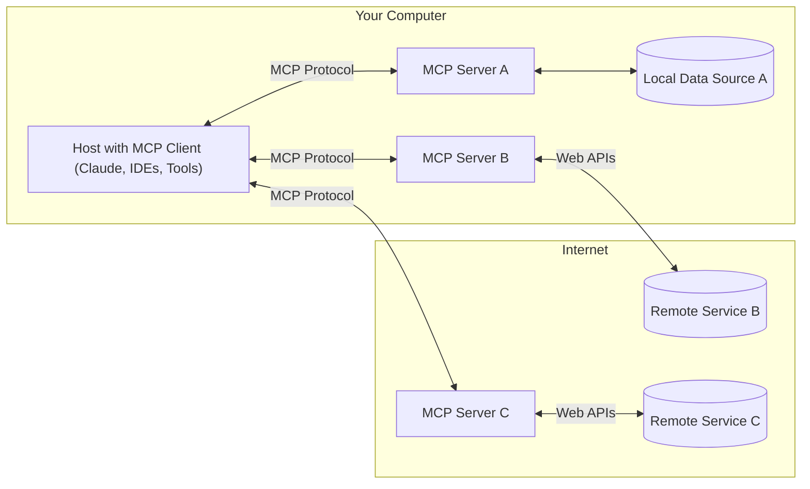

# Introducing MCP

Today, we're open-sourcing the Model Context Protocol (MCP), a new standard for connecting AI assistants to the systems where data lives, including content repositories, business tools, and development environments. Its aim is to help frontier models produce better, more relevant responses.

As AI assistants gain mainstream adoption, the industry has invested heavily in model capabilities, achieving rapid advances in reasoning and quality. Yet even the most sophisticated models are constrained by their isolation from data—trapped behind information silos and legacy systems. Every new data source requires its own custom implementation, making truly connected systems difficult to scale.

MCP addresses this challenge. It provides a universal, open standard for connecting AI systems with data sources, replacing fragmented integrations with a single protocol. The result is a simpler, more reliable way to give AI systems access to the data they need.

## Model Context Protocol

The Model Context Protocol is an open standard that enables developers to build secure, two-way connections between their data sources and AI-powered tools. The architecture is straightforward: developers can either expose their data through MCP servers or build AI applications (MCP clients) that connect to these servers.

Today, we're introducing three major components of the Model Context Protocol for developers:

The Model Context Protocol specification and SDKs
Local MCP server support in the Claude Desktop apps
An open-source repository of MCP servers
Claude 3.5 Sonnet is adept at quickly building MCP server implementations, making it easy for organizations and individuals to rapidly connect their most important datasets with a range of AI-powered tools. To help developers start exploring, we’re sharing pre-built MCP servers for popular enterprise systems like Google Drive, Slack, GitHub, Git, Postgres, and Puppeteer.

Early adopters like Block and Apollo have integrated MCP into their systems, while development tools companies including Zed, Replit, Codeium, and Sourcegraph are working with MCP to enhance their platforms—enabling AI agents to better retrieve relevant information to further understand the context around a coding task and produce more nuanced and functional code with fewer attempts.

"At Block, open source is more than a development model—it’s the foundation of our work and a commitment to creating technology that drives meaningful change and serves as a public good for all,” said Dhanji R. Prasanna, Chief Technology Officer at Block. “Open technologies like the Model Context Protocol are the bridges that connect AI to real-world applications, ensuring innovation is accessible, transparent, and rooted in collaboration. We are excited to partner on a protocol and use it to build agentic systems, which remove the burden of the mechanical so people can focus on the creative.”

Instead of maintaining separate connectors for each data source, developers can now build against a standard protocol. As the ecosystem matures, AI systems will maintain context as they move between different tools and datasets, replacing today's fragmented integrations with a more sustainable architecture.

## Getting started

Developers can start building and testing MCP connectors today. All Claude.ai plans support connecting MCP servers to the Claude Desktop app.

Claude for Work customers can begin testing MCP servers locally, connecting Claude to internal systems and datasets. We'll soon provide developer toolkits for deploying remote production MCP servers that can serve your entire Claude for Work organization.

To start building:

Install pre-built MCP servers through the Claude Desktop app
Follow our quickstart guide to build your first MCP server
Contribute to our open-source repositories of connectors and implementations

## An open community

We’re committed to building MCP as a collaborative, open-source project and ecosystem, and we’re eager to hear your feedback. Whether you’re an AI tool developer, an enterprise looking to leverage existing data, or an early adopter exploring the frontier, we invite you to build the future of context-aware AI together.

---

Get started with the Model Context Protocol (MCP)
MCP is an open protocol that standardizes how applications provide context to LLMs. Think of MCP like a USB-C port for AI applications. Just as USB-C provides a standardized way to connect your devices to various peripherals and accessories, MCP provides a standardized way to connect AI models to different data sources and tools.

## Why MCP?

MCP helps you build agents and complex workflows on top of LLMs. LLMs frequently need to integrate with data and tools, and MCP provides:

A growing list of pre-built integrations that your LLM can directly plug into
The flexibility to switch between LLM providers and vendors
Best practices for securing your data within your infrastructure

## General Architecture

At its core, MCP follows a client-server architecture where a host application can connect to multiple servers:

- MCP Hosts: Programs like Claude Desktop, IDEs, or AI tools that want to access data through MCP
- MCP Clients: Protocol clients that maintain 1:1 connections with servers
- MCP Servers: Lightweight programs that each expose specific capabilities through the standardized Model Context Protocol
- Local Data Sources: Your computer’s files, databases, and services that MCP servers can securely access
- Remote Services: External systems available over the internet (e.g., through APIs) that MCP servers can connect to

## MCP Servers

<https://modelcontextprotocol.io/quickstart/server>

MCP servers can provide three main types of capabilities:

1. Resources: File-like data that can be read by clients (like API responses or file contents)
2. Tools: Functions that can be called by the LLM (with user approval)
3. Prompts: Pre-written templates that help users accomplish specific tasks

## MCP Clients

<https://modelcontextprotocol.io/quickstart/client>
